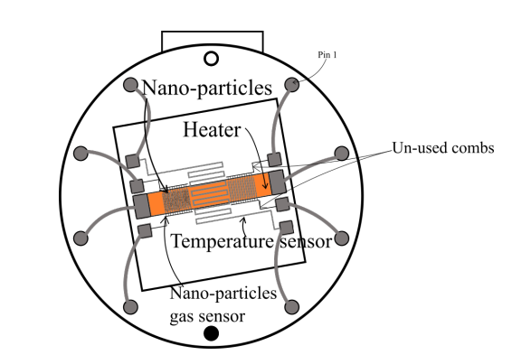
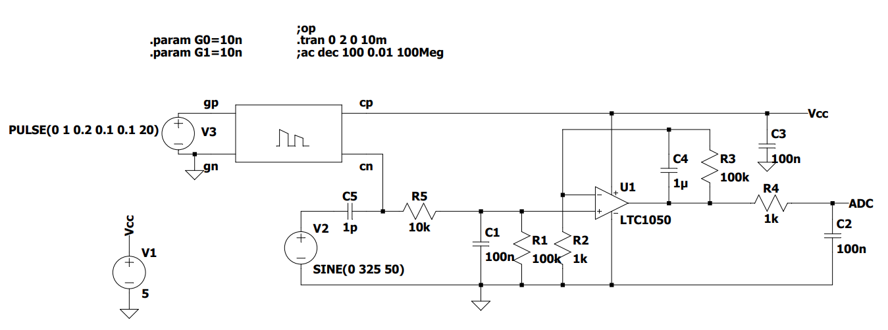
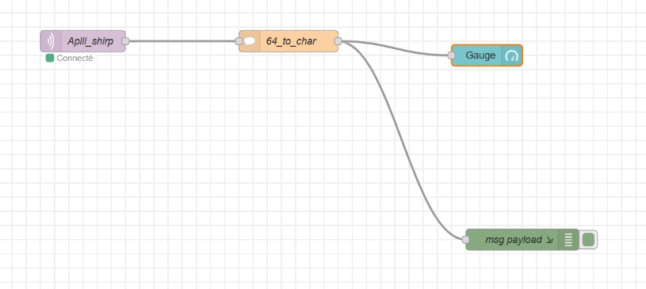
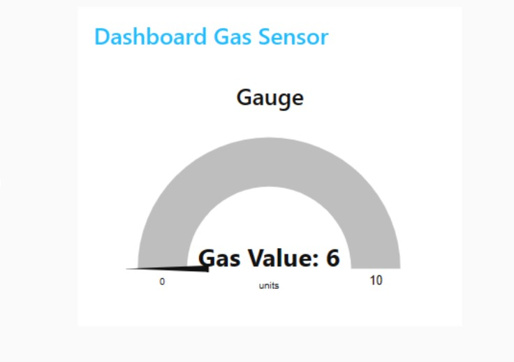

# M-OSH - Gas Sensor
Amine Hatibi and Abdelmajid Anka Soubaii crafted this as a part of the Microcontroller and Open Source Hardware course within Innovative Smart Systems.

## Project Aim
As participants in the Innovative Smart Systems major, our focus revolved around the development of a gas sensor. Commencing our project in the AIME laboratory, we initiated the process by conceiving and constructing the sensor. Subsequent stages involved working on schematics, routing, wiring, programming, and addressing wireless communication and network aspects.

This undertaking served as a comprehensive assessment of our proficiencies across various key domains in this field, including network knowledge, programming skills, and electronics expertise. In this report, we will provide a detailed account of the steps we took to achieve the conclusive results.

## GitHub Content

### Delivrables 

Within this repository, you'll find the following files organized as follows:

**On the main branch:**
- LTSpice simulation files
- KiCad schematics and routing files
- Arduino code for the smart sensor
- Datasheet for the sensor
- README.md

**On the FakeGasSensor branch:**
- Arduino code designed for a simplified version of the project, as outlined below, utilizing a commercially available sensor.

### Material required to run the project

For project execution, we utilized an Arduino UNO, a LoRa module, and gas sensors developed at the AIME laboratory. A detailed list of components is provided below. Additionally, access to a LoRa gateway and a network server (ChirpStack in this case) is required.

## Introduction to LoRa and Gas Sensors
To enhance our understanding of both gas sensors and the LoRa protocol, previously unfamiliar to us, we chose to develop a straightforward sample program. This particular program is accessible on the FakeGasSensor branch.

### How to run the program
For this, we had to use the LoRa gateway at INSA via Chirpstack. To replicate this program, it is necessary to add the LoRa chip you use to the INSA network on https://srv-chirpstack.insa-toulouse.fr 

You will also need: 
- An Arduino UNO
- A RN2483 LoRa module + Antenna
- A gas sensor
- Cables 

### Results
The application transmits a message upon gas detection, represented by the digit "1" equivalent to "0x31" in ASCII. Subsequent messages are withheld until the gas level drops below the predefined threshold, triggering the transmission of a "0" interpreted as "0x30" in ASCII.

## AIME Gas Sensor and KiCad
Following our initial exploration with the industrial sensor, we delved into the development of the ultimate project.

### Project Objectives
In our pursuit of developing a smart sensor, the aim is to enable it to execute a range of functions autonomously. These tasks include:
- Self-calibration
- Temperature measurement, with the ability to regenerate if outside specified temperature ranges
- Gas identification by comparing measured values to established characteristics
- Transmission of data via LoRa to a gateway

### AIME Sensor
The sensor made at AIME has the following schematics:

There are 10 pins, which are:
- Two N.C. 
- The heating resistor (up to 20V).
- The temperature sensor.
- The gas sensors themselves (2 of them, so we could theorically have two areas for detecting and evene detect different gases).

## Amplifying the Signal from the Sensor
The gas sensor made has a huge resistance which varies depending on the presence of gas and on the nature of said gas. The value of the resistance will be around a G&Omega; meaning the current that will flow through it and to the ADC will be extremely small (around a nA). Since we will use an Arduino with only a 10-bit ADC, we need to amplify the signal exiting the gas sensor. To do so, we designed an amplifier circuit based on an operational amplifier using LTSpice. 

### LTSpice Simulation
The amplifier is based on 3 different filters, each with their own cutoff frequency. The first filter is centered around C1, R1 and R5, the second one from C4 and R3 and the last one from C2 and R4.
To better simulate the behaviour of the circuit, we created a component to simulate the gas sensor behavior as closely as possible. The sensor component is actually a circuit itself:

The circuit as a whole is as follows:

### Caracterizing the Amplification

Below are the cutoff frequencies of each filter.

| Filter | Cutoff frequency |
|--------|------------------|
| 1      | 16 Hz            |
| 2      | 1.6 Hz           |
| 3      | 1600 Hz          |

These filters have different purposes:
- The first filter is used to filter the sensor's noise itself
- The second filter is used to filter the 50Hz frequency from the power grid.
- The last filter is an anti-aliasing filter.

From this circuit we can deduce the resistance value of the gas sensor from the voltage on the ADC using the following formula:

Where R is the resistance of the sensor and VADC is the voltage detected by the ADC (between 0 and +5V, coded between 0 and 1023).

## Printed Circuit Board (PCB) design using KiCad

As the PCB had to be printed following the university's requirements and technological limitations, we could only use one layer to route the circuit. 

The required components are: 
- 100nF capacitors (3)
- 1uF capacitor (1) 
- 100k&Omega; resistors (2)
- 10k&Omega; resistors (2)
- 1k&Omega; resistors (2)
- 100&Omega; resistor (1)
- LTC1050 pp-amp (1)
- MCP41100 potentiometer (1) 
- SLW12 two-position switch (1)
- Arduino Uno (1)
- IRF520 NMOS (1)
- 7-pin header (1) for a LoRa RN2483 module

And the gas sensor conceived at AIME in a TO-5 10-pin package. The PCB is made to work with an Arduino shield. 

Below is a view of the routed PCB on KiCad.

## Programming the Sensor

The programming approach involved creating distinct functions for each predefined state, including regeneration, calibration, and measuring. The objective was to make the system as self-sufficient as possible.

The core of the Arduino code is straightforward:
- In the setup:
  - Initialize LoRa communication (initializeRadio)
  - Calibrate the gain using the potentiometer (calibration)
  - Allow the user to select the operating temperature
- In the main program:
  - Verify that the temperature falls within the specified operating range (checkTemperature)
  - If not, initiate the regeneration process (regeneration)
  - Measure the gas (measureGas) and transmit the data (commLoRa)
  
### Gas Identification

As previously outlined, the sensor exhibits the capability to distinguish between two distinct gases: Ethanol and Ammonia. This discrimination is achieved by comparing the sensitivity regression curve of the measured gas (in Volts) to established values specific to both Ethanol and Ammonia.

### Improving Energy Consumption

Managing energy consumption is a critical metric in IoT, and here are several strategies to enhance existing systems for low power usage:

1. Substituting the Arduino with a low-power microcontroller and implementing programming at a lower level.
2. Fine-tuning the gas sensor to operate without the need for a 12V power supply.
3. Employing a low-energy protocol, such as Bluetooth Low Energy, or devising a protocol tailored to this particular application, a practice successfully executed in other ISS courses.

## Node-RED

To conclude this project, we crafted a dashboard using Node-RED to display values transmitted through LoRa. The dashboard is straightforward, presenting the latest received message along with details such as gas type and the presence of gas. The flow diagram is provided below, accompanied by a GIF showcasing the dashboard in action.

[

## Conclusion and Future Work
At the project's conclusion, we have developed the foundational components of an intelligent sensor system that can be monitored through an external application. To complete this endeavor, it is essential to refine the program by incorporating precise gas sensitivity values for the sensor.

Nonetheless, this repository establishes a robust foundation for conceptualizing and utilizing the smart sensor, encompassing a comprehensive perspective spanning physical, electrical, and software aspects.